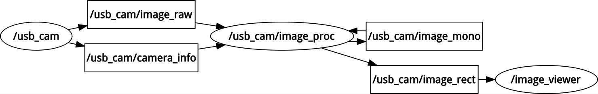

Concepts
========

auROS is based on the ROS robotics middleware. ROS allows high performance, network transparent interprocess communication. The following documentation is partially from the ROS project and summarizes the main concepts.

Nodes
-----

A node is a process that performs computation. Nodes are combined together into a graph and communicate with one another using streaming topics, RPC services, and the Parameter Server. 
These nodes are meant to operate at a fine-grained scale; a robot control system will usually comprise many nodes. 
For example, one node controls a laser range-finder, one Node controls the robot's wheel motors, one node performs localization, one node performs path planning, one node provide a graphical view of the system, and so on.
The use of nodes in ROS provides several benefits to the overall system. There is additional fault tolerance as crashes are isolated to individual nodes. Code complexity is reduced in comparison to monolithic systems. 
Implementation details are also well hidden as the nodes expose a minimal API to the rest of the graph and alternate implementations, even in other programming languages, can easily be substituted.

All running nodes have a graph resource name that uniquely identifies them to the rest of the system. For example, /sensors/eo/visible_colour could be the name of a camera driver broadcasting images. 
Nodes also have a node type, that simplifies the process of referring to a node executable on the fileystem. 
These node types are package resource names with the name of the node's package and the name of the node executable file. 
In order to resolve a node type, ROS searches for all executables in the package with the specified name and chooses the first that it finds. 
As such, you need to be careful and not produce different executables with the same name in the same package.
A ROS node is written with the use of a ROS client library, such as roscpp or rospy.

For more information see http://wiki.ros.org/Nodes.

Topics
------

Topics are named buses over which nodes exchange messages. 
Topics have anonymous publish/subscribe semantics, which decouples the production of information from its consumption. 
In general, nodes are not aware of who they are communicating with. 
Instead, nodes that are interested in data subscribe to the relevant topic; nodes that generate data publish to the relevant topic. 
There can be multiple publishers and subscribers to a topic.

Topics are intended for unidirectional, streaming communication. Nodes that need to perform remote procedure calls, i.e. receive a response to a request, should use :ref:`services` instead. 
There is also the Parameter Server for maintaining small amounts of state.

For more information see http://wiki.ros.org/Topics.

Namespaces
----------

Graph Resource Names provide a hierarchical naming structure that is used for all resources in a ROS Computation Graph, such as Nodes, Parameters, Topics, and Services. These names are very powerful in ROS and central to how larger and more complicated systems are composed in ROS, so it is critical to understand how these names work and how you can manipulate them.

Before we describe names further, here are some example names:

    / (the global namespace)

    /r1 (a real aircraft)

    /v1 (a virtual aircraft)

Graph Resource Names are an important mechanism in ROS for providing encapsulation. Each resource is defined within a namespace, which it may share with many other resources. In general, resources can create resources within their namespace and they can access resources within or above their own namespace. Connections can be made between resources in distinct namespaces, but this is generally done by integration code above both namespaces. This encapsulation isolates different portions of the system from accidentally grabbing the wrong named resource or globally hijacking names.

Names are resolved relatively, so resources do not need to be aware of which namespace they are in. This simplifies programming as nodes that work together can be written as if they are all in the top-level namespace. When these Nodes are integrated into a larger system, they can be pushed down into a namespace that defines their collection of code.

In the context of auros, for multiple aircraft operations a node which operates per vehicle will be started in the namespace for that vehicle. All calls to a topic or parameter (such as /fcu/...) will be automatically remapped to the relevant aircraft (/r1/fcu/...) without any additional work.
Nodes which require access to all aircraft should use global addresses and be run in the global namespace. However, this approach is far less flexible than the node per aircraft method.

.. _services:

Services
--------

The publish / subscribe model is a very flexible communication paradigm, but its many-to-many one-way transport is not appropriate for RPC request / reply interactions, which are often required in a distributed system. 
Request / reply is done via a Service, which is defined by a pair of messages: one for the request and one for the reply. 
A providing ROS node offers a service under a string name, and a client calls the service by sending the request message and awaiting the reply. 
Client libraries usually present this interaction to the programmer as if it were a remote procedure call.

Services are defined using srv files, which are compiled into source code by a ROS client library.

A client can make a persistent connection to a service, which enables higher performance at the cost of less robustness to service provider changes.

For more information see http://wiki.ros.org/Services.

Messages
--------

Nodes communicate with each other by publishing messages to topics. A message is a simple data structure, comprising typed fields. Standard primitive types (integer, floating point, boolean, etc.) are supported, as are arrays of primitive types. Messages can include arbitrarily nested structures and arrays (much like C structs).

Nodes can also exchange a request and response message as part of a ROS service call. These request and response messages are defined in srv files.

A message may include a special message type called 'Header', which includes some common metadata fields such as a timestamp and a frame ID. 
The ROS Client Libraries will automatically set some of these fields for you if you wish, so their use is highly encouraged.

There are three fields in the header message shown below. The seq field corresponds to an id that automatically increases as messages are sent from a given publisher. 
The stamp field stores time information that should be associated with data in a message. In the case of a laser scan, for example, the stamp might correspond to the time at which the scan was taken. 
The frame_id field stores frame information that should be associated with data in a message. In the case of a laser scan, this would be set to the frame in which the scan was taken.

For more information see http://wiki.ros.org/Messages.

Overview
--------

The above illustrates a simple ROS pipeline for image processing. The usb_cam node provides two published topics, /usb_cam/image_raw and /usb_cam/camera_info. The image_raw topic publishes :ref:`sensor_msgs/Image` messages,
and the camera_info topic a message with information about the camera calibration matrix. The image_proc node consumes these images, converts the image to grayscale and then rectifies the image to remove any lens distortion.

The image_raw topic is then consumed by the image_viewer node, which displays the image onscreen. All nodes can run on seperate machines, communicating over UDP, or a local machine in which case image messages may use shared memory.
These details are all abstracted by the ROS client library.